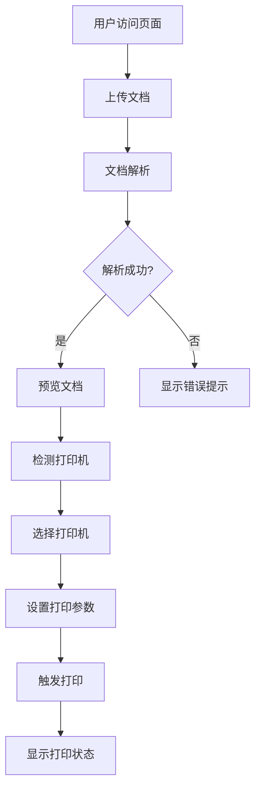

## 1. Product Overview

自动化打印功能前端页面，为用户提供便捷的文档上传、预览和打印控制体验。解决用户在网页端直接处理文档打印的需求，支持多种文档格式，提供直观的打印参数设置界面。

## 2. Core Features

### 2.1 User Roles
| Role | Registration Method | Core Permissions |
|------|---------------------|------------------|
| Normal User | None | Upload documents, select printers, preview and print |

### 2.2 Feature Module
1. **文件上传模块**: 支持拖放和文件选择器上传文档
2. **打印机管理模块**: 检测和选择可用打印机设备
3. **文档预览模块**: 解析并展示上传的文档内容
4. **打印控制模块**: 设置打印参数并触发打印操作

### 2.3 Page Details
| Page Name | Module Name | Feature description |
|-----------|-------------|---------------------|
| 打印中心 | 文件上传区 | 拖放区域、文件选择按钮、支持PDF/Word/图片格式 |
| 打印中心 | 打印机列表 | 检测并显示可用打印机、默认打印机选择 |
| 打印中心 | 文档预览 | PDF预览、图片预览、文档信息展示 |
| 打印中心 | 打印设置 | 纸张大小、方向、份数、色彩模式设置 |
| 打印中心 | 状态反馈 | 上传进度、处理状态、错误提示 |

## 3. Core Process

用户上传文档 → 系统检测打印机 → 用户预览文档 → 设置打印参数 → 触发打印操作

## 4. User Interface Design

### 4.1 Design Style
- **主色调**: 深蓝色 (#1e40af) 搭配白色背景
- **辅助色**: 青色 (#06b6d4) 用于强调和交互元素
- **按钮风格**: 圆角矩形，主按钮深蓝色背景白色文字
- **字体**: 使用 Inter 字体，清晰易读
- **布局风格**: 卡片式布局，左侧文档列表，右侧预览和设置区域
- **图标**: 使用 Lucide React 图标库

### 4.2 Page Design Overview
| Page Name | Module Name | UI Elements |
|-----------|-------------|-------------|
| 打印中心 | 顶部导航 | Logo、标题、操作按钮 |
| 打印中心 | 上传区域 | 拖放区域(虚线边框)、上传按钮、支持格式提示 |
| 打印中心 | 文档列表 | 文件名称、大小、格式图标、删除按钮 |
| 打印中心 | 文档预览 | 预览画布、缩放控制、页面导航 |
| 打印中心 | 打印机选择 | 下拉选择器、刷新按钮、打印机状态 |
| 打印中心 | 打印设置 | 纸张大小选择、方向切换、份数输入、色彩模式选择 |
| 打印中心 | 操作区域 | 打印按钮、重置按钮、状态指示器 |

### 4.3 Responsiveness
- **桌面端**: 完整功能布局，左侧文档列表，右侧预览和设置
- **平板端**: 响应式布局，文档列表和预览区域垂直排列
- **移动端**: 简化布局，分步操作，底部操作栏

### 4.4 3D Scene Guidance
Not applicable