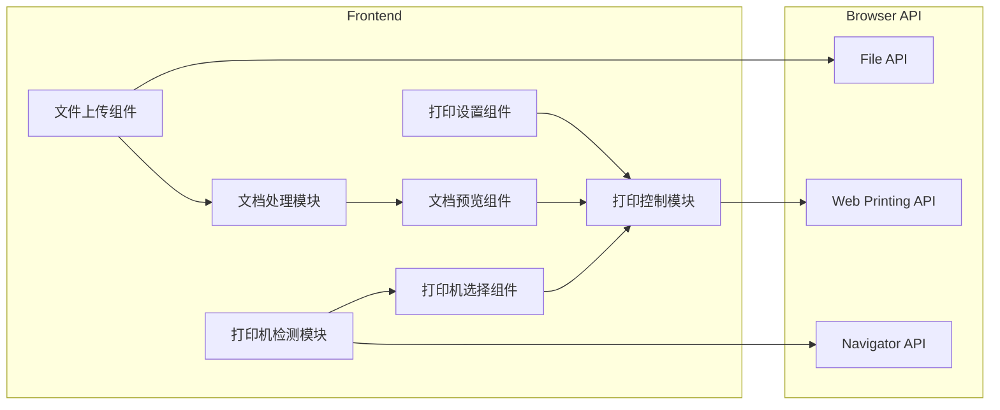
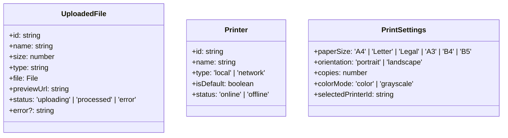

## 1. Architecture Design



## 2. Technology Description

- **Frontend**: React@18 + TypeScript + TailwindCSS@3 + Vite
- **Initialization Tool**: vite-init
- **Backend**: None (纯前端应用)
- **State Management**: Zustand
- **PDF Preview**: Mozilla PDF.js
- **Icons**: Lucide React

## 3. Route Definitions

| Route | Purpose |
|-------|---------|
| / | 打印中心主页 |

## 4. API Definitions

### 4.1 Browser API Usage

#### 4.1.1 File API
- `FileReader`: 读取上传文件内容
- `File`: 文件对象处理

#### 4.1.2 Web Printing API
- `window.print()`: 触发浏览器打印对话框
- `@media print`: CSS打印样式

#### 4.1.3 Navigator API
- `navigator.mediaDevices.enumerateDevices()`: 检测设备

## 5. Server Architecture Diagram

Not applicable (纯前端应用)

## 6. Data Model

### 6.1 Data Model Definition



### 6.2 Data Structure

```typescript
interface UploadedFile {
  id: string;
  name: string;
  size: number;
  type: string;
  file: File;
  previewUrl: string;
  status: 'uploading' | 'processed' | 'error';
  error?: string;
}

interface Printer {
  id: string;
  name: string;
  type: 'local' | 'network';
  isDefault: boolean;
  status: 'online' | 'offline';
}

interface PrintSettings {
  paperSize: 'A4' | 'Letter' | 'Legal' | 'A3' | 'B4' | 'B5';
  orientation: 'portrait' | 'landscape';
  copies: number;
  colorMode: 'color' | 'grayscale';
  selectedPrinterId: string;
}
```

## 7. Component Structure

```
src/
├── components/
│   ├── Header/
│   │   └── index.tsx
│   ├── FileUpload/
│   │   └── index.tsx
│   ├── DocumentList/
│   │   └── index.tsx
│   ├── DocumentPreview/
│   │   └── index.tsx
│   ├── PrinterSelector/
│   │   └── index.tsx
│   ├── PrintSettings/
│   │   └── index.tsx
│   └── StatusBar/
│       └── index.tsx
├── hooks/
│   ├── useFileUpload.ts
│   ├── usePrinterDetection.ts
│   └── usePrint.ts
├── stores/
│   └── printStore.ts
├── utils/
│   ├── fileUtils.ts
│   └── printUtils.ts
├── App.tsx
└── main.tsx
```

## 8. Key Features Implementation

### 8.1 文件上传
- 使用 HTML5 Drag and Drop API
- 文件选择器 input[type="file"]
- 支持格式: PDF, DOC, DOCX, PNG, JPG, JPEG, GIF

### 8.2 打印机检测
- 使用 `navigator.mediaDevices.enumerateDevices()`
- 过滤视频/音频设备，识别打印机设备
- 显示打印机列表和状态

### 8.3 文档预览
- PDF: 使用 Mozilla PDF.js 渲染
- 图片: 使用 img 标签直接展示
- Word: 转换为预览图或显示文档信息

### 8.4 打印控制
- 使用 `window.print()` 触发打印
- CSS @media print 设置打印样式
- 支持设置纸张大小、方向、份数等参数